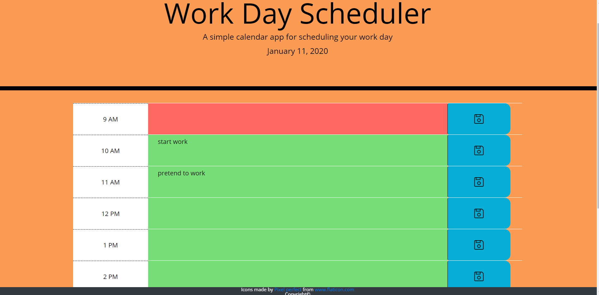

# day-planner
https://greichman.github.io/day-planner/
 
By: Garrett Reichman

## Description
   This project was made to practice assigning managing generic click handlers using the 'this' keyword. It also was made to build comfortability with using 3rd party Api's. The application loads a page of rows relating to each hour in a typical 9-5 workplace. Each row contains the time slot, a field to input an event, and a button to save the event to local storage. The page will change the backgrounds of each row in relation to the current time. If a timeslot is in the past it will be gray,red for present, and green for future. The background color of the page will also change colors depending on time of day.

## Ussage
   To begin using the day planner, click the center box of any time row and type out an event you would like to save. Once you have finished recording an event, click the save button on the same row and it will store the event for later viewing.

